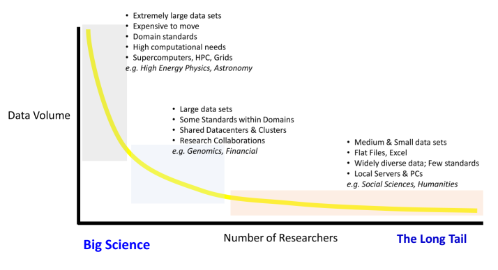
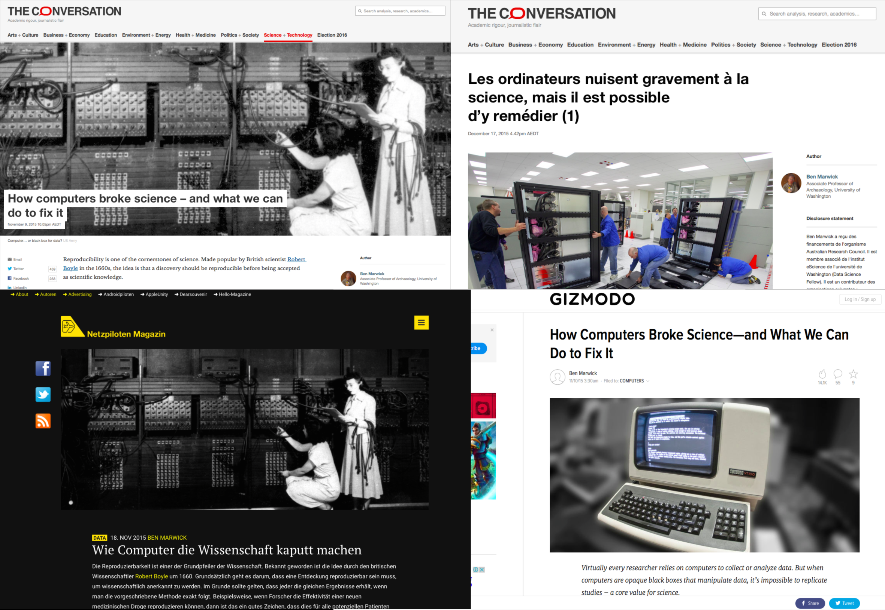
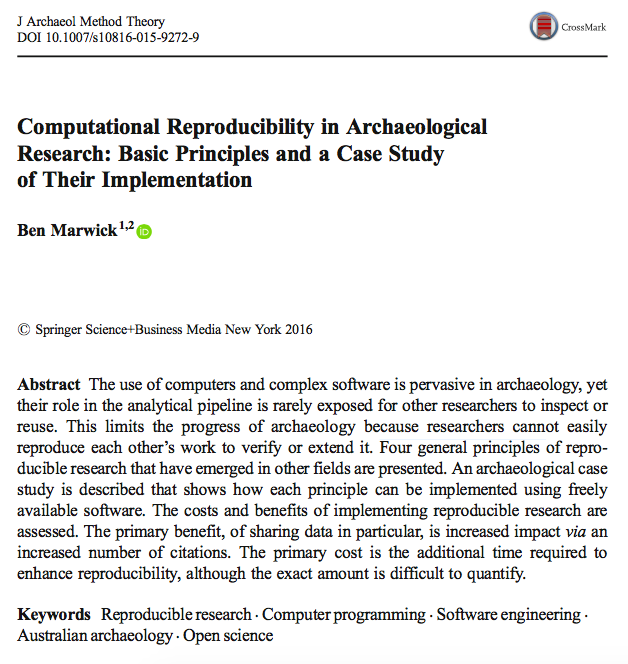
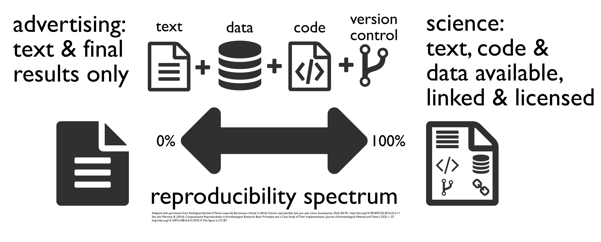
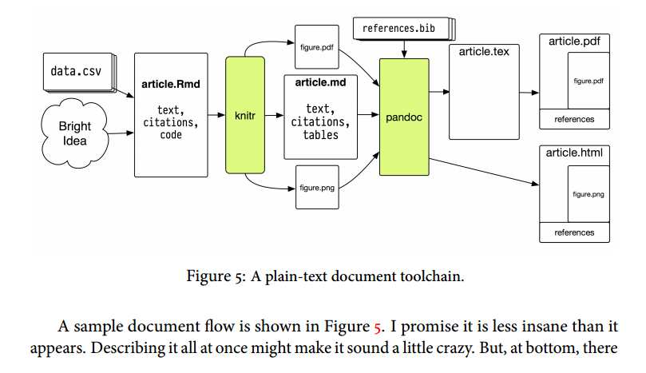
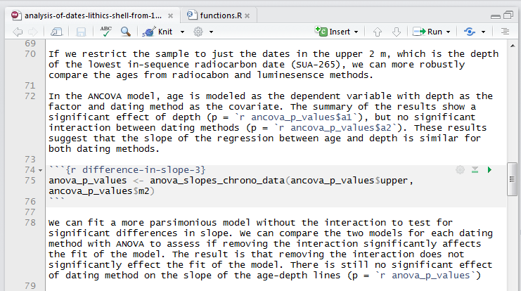
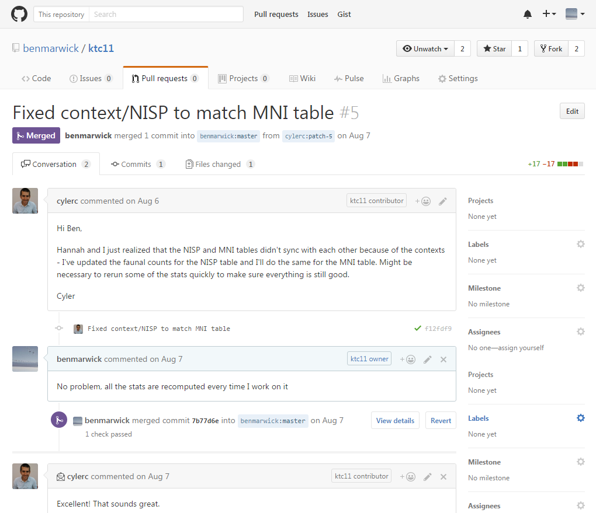
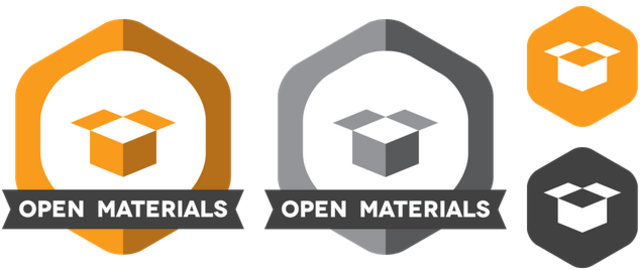

<!-- 
https://www.math.ethz.ch/sfs/news-and-events/seminar-applied-statistics.html

2 March 2017 16:15-17:00	

Ben Marwick, University of Washington, Seattle

Reproducible Research Compendia via R packages 	HG G 19.1 
Abstract: "Long considered an axiom of science, the reproducibility of scientific research has recently come under scrutiny after some highly-publicized failures to reproduce results. This has often been linked to the failure of the current model of journal publishing to provide enough details for reviewers to adequately assess the correctness of papers submitted for publication. One early proposal for ameliorating this situation is to bundle the different files that make up a research result into a publicly-available 'compendium'. At the time it was originally proposed, creating a compendium was a complex process. In this talk I show how modern software tools and services have substantially lightened the burden of making compendia. I describe current approaches to making these compendia to accompany journal articles. Several recent projects of varying sizes are briefly presented to show how my colleagues and I are using R and related tools (e.g. version control, continuous integration, containers, repositories) to make compendia for our publications. I explain how these approaches, which we believe to be widely applicable to many types of research work, subvert the constraints of the typical journal article, and improve the efficiency and reproducibility of our research."

-->

<HEAD><link rel="stylesheet" href="figures/font-awesome-4.6.3/css/font-awesome.min.css">

<link rel="stylesheet" href="figures/academicons-1.6.0/css/academicons.css" />

</HEAD>

```{r setup, include=FALSE}
knitr::opts_chunk$set(echo = FALSE)
```

## Overview {.bigger40}

<div><span style="font-size:1.5em; line-height:1.6em">
<i class="fa fa-question-circle  fa-1.7x"></i> Motivation    
<i class="fa fa-university   fa-1.7x"></i> Four general principles    
<i class="fa fa-briefcase  fa-1.7x"></i> Case studies    
<i class="fa fa-balance-scale  fa-1.7x"></i> Costs and benefits     
</div></span>

##  {.mySegue}

<div><span style="font-size:0.7em; line-height:1.3em">
<i class="fa fa-question-circle   fa-1.7x"></i> Motivation
</div></span>

## {.flexbox .vcenter #myImagePage1}


<!-- from Tony Hey presentation on 'Open Science Decoded' -->

## {.flexbox .vcenter #myImagePage1}

[](https://medium.com/@benmarwick/how-computers-broke-science-and-what-we-can-do-to-fix-it-5d413559ca03#.pjits81yh)

## Key ideas {.bigger40}

<div><span style="font-size:1.1em; line-height:1.5em">
<i class="fa fa-lightbulb-o  fa-1.5x"></i> Reproducibilty is necessary for scientific progress        
<i class="fa fa-lightbulb-o  fa-1.5x"></i> Computers wrangle the data, but also obscure it       
<i class="fa fa-lightbulb-o  fa-1.5x"></i> Especially point-and-click actions    
<i class="fa fa-lightbulb-o  fa-1.5x"></i> Technical solutions available in open source/format/data/access   
</div></span>

## {.flexbox .vcenter #myImagePage2}

[](http://link.springer.com/article/10.1007/s10816-015-9272-9)

##  {.mySegueSmall}

<div><span style="font-size:0.7em; line-height:1.3em">
<i class="fa fa-university   fa-1.7x"></i> Four general principles of reproducible research that have emerged in other fields
</div></span>


## {.bigger40}

<b><font color="green">✓</font></b> Make openly available the data and methods that generated the published result

<b><font color="green">✓</font></b> Write scripts to conduct analyses

<b><font color="green">✓</font></b> Use version control to track changes 

<b><font color="green">✓</font></b> Describe and archive the computational environment

##   

<a href="https://osf.io/preprints/socarxiv/72n8g/">

</a>


## First principle  {.bigger55} 

<i class="ai ai-figshare ai-1.5x"></i> All files on [figshare](https://figshare.com/), [OSF](https://osf.io/), university data repo, or similar

 Data in CSV format

<i class="fa fa-folder-open-o fa-1.5x"></i> Organised as an [R package](http://r-pkgs.had.co.nz/)


## Second principle  {.bigger40}

 [R](https://www.r-project.org/) & [Rmarkdown](http://rmarkdown.rstudio.com/) documents

<a href="http://plain-text.co/">

</a>

## {.flexbox .vcenter #myImagePage1}

[](https://github.com/benmarwick/1989-excavation-report-Madjebebe/blob/master/vignettes/analysis-of-dates-lithics-shell-from-1989-excavations.Rmd)

## Third principle  {.bigger40}

<i class="fa fa-github fa-1.5x"></i> All files tracked with [Git](https://git-scm.com/), hosted on [GitHub](https://github.com/benmarwick)
<!-- https://github.com/benmarwick/1989-excavation-report-Madjebebe -->

<i class="fa fa-user fa-1.5x"></i> Collaboration occurred via GitHub's ['flow'](https://guides.github.com/introduction/flow/)

## {.flexbox .vcenter #myImagePage600x500}

[](https://github.com/benmarwick/ktc11/pulls?q=is%3Apr+is%3Aclosed)

## Fourth principle  {.bigger40}

 [Docker](https://benmarwick.github.io/UW-eScience-docker-for-reproducible-research/#1) image and Dockerfile to contain RStudio, packages, code and external dependencies 
<!-- https://hub.docker.com/r/benmarwick/mjb1989excavationpaper/ -->

 Based on [Rocker](https://github.com/rocker-org/rocker/wiki/Using-the-RStudio-image) image and templates

## Continuous integration is very helpful

<div><span style="font-size:3em; line-height:1.5em">
 [.travis.yml](https://github.com/benmarwick/mjbtramp/blob/master/.travis.yml)    
 [circle.yml](https://github.com/benmarwick/mjbtramp/blob/master/circle.yml)     
</div></span>

##  {.mySegueSmall}

<div><span style="font-size:0.7em; line-height:1.3em">
<i class="fa fa-briefcase   fa-1.7x"></i> Case Studies of Compendia
</div></span>

##  {.bigger40}

<div><span style="font-size:2em; line-height:1.5em">
<i class="fa fa-briefcase fa-1.5x"></i> [Small](https://github.com/cylerc/AP_SC)  
<i class="fa fa-briefcase fa-1.5x"></i> [Medium](https://github.com/benmarwick/1989-excavation-report-Madjebebe)    
<i class="fa fa-briefcase fa-1.5x"></i> [Large](https://github.com/benmarwick/ktc11)     
    
 
</div></span>

## Research compendium +

<div><span style="font-size:2em; line-height:1.5em">
<i class="fa fa-folder-open fa-1.5x"></i> VCS repository 
</div></span>

containing...

<div><span style="font-size:2em; line-height:1.5em">
<i class="fa fa-file-text-o fa-1.5x"></i> README.md    
<i class="fa fa-folder-open fa-1.5x"></i> R package & manuscript    
<i class="fa fa-file-code-o fa-1.5x"></i> code CI     
<i class="fa fa-file-code-o fa-1.5x"></i> environment CI      
 
</div></span>

##  {.mySegue}

<div><span style="font-size:0.7em; line-height:1.3em">
<i class="fa fa-balance-scale  fa-1.7x"></i> Costs & benefits
</div></span>

## Costs  {.bigger45 .build}

<i class="fa fa-clock-o  fa-1.5x"></i> Time learning the tools 

<i class="fa fa-calendar  fa-1.5x"></i> Time doing new things  

<i class="fa fa-wrench  fa-1.5x"></i> Built-in vs Bolt-on

## Benefits {.bigger40 .build}

<i class="fa fa-graduation-cap fa-1.5x"></i> Comfort of knowing that I am right & have no secrets

<i class="fa fa-clock-o  fa-1.5x"></i> Save time by reusing my previous code

<i class="fa fa-line-chart fa-1.5x"></i> Open data confers citation advantages, but magnitude is highly variable

<i class="fa fa-users fa-1.5x"></i> Open Source community membership provides access to high-quality help

## Sustainability  


## Two implications: Training {.bigger40}


## Two implications: Incentives {.bigger40}

<a href="https://github.com/uwescience-open-badges">




</a>

<!-- http://www.nature.com/news/digital-badges-motivate-scientists-to-share-data-1.19907 --> 

<!-- https://osf.io/tvyxz/ -->

## Summary {.bigger35}

<i class="fa fa-chevron-circle-right fa-1.5x"></i> Open methods and materials, scripted workflow, version control and environment control are generic principles suitable for most fields of research 

<i class="fa fa-chevron-circle-right fa-1.5x"></i> The specific details will change over time, but the principles will endure    

<i class="fa fa-chevron-circle-right fa-1.5x"></i> For most people, the technical problems already have good solutions, the remaining challenge is cultural    


## Colophon

Presentation written in [R Markdown using ioslides](http://rmarkdown.rstudio.com/ioslides_presentation_format.html)

Compiled into HTML5 using [RStudio](http://www.rstudio.com/ide/) & [knitr](http://yihui.name/knitr)

Source code hosting:
https://github.com/benmarwick/

ORCID: http://orcid.org/0000-0001-7879-4531

Licensing: 

* Presentation: [CC-BY-3.0](http://creativecommons.org/licenses/by/3.0/us/)

* Source code: [MIT](http://opensource.org/licenses/MIT) 

